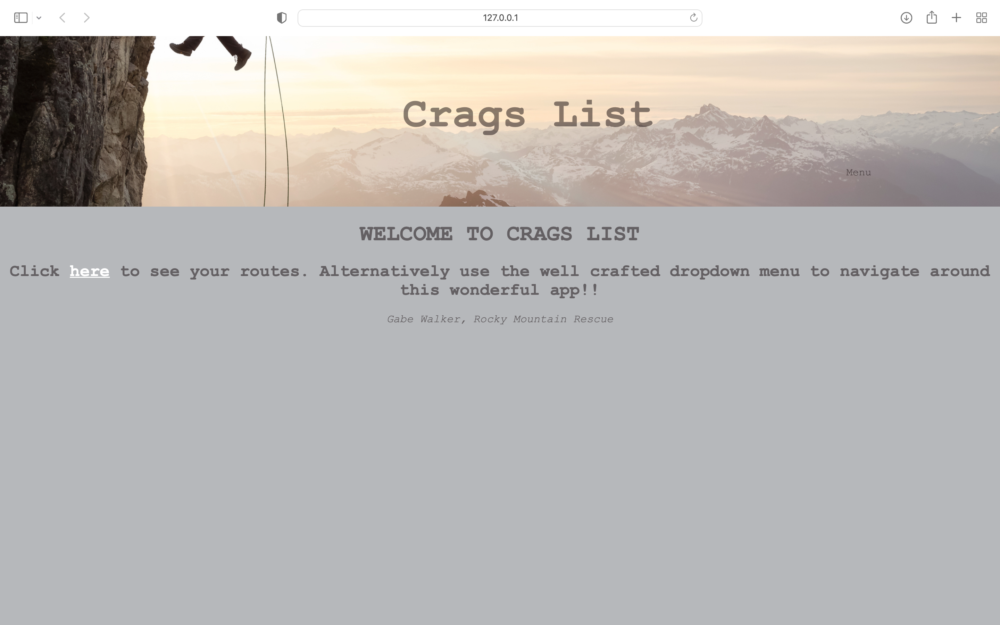
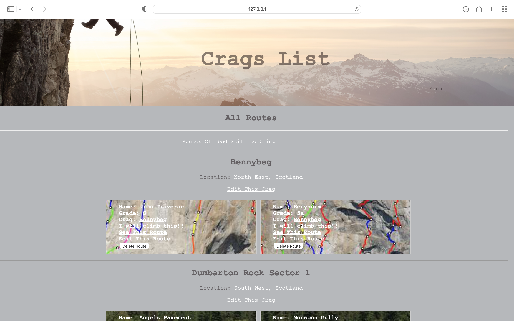
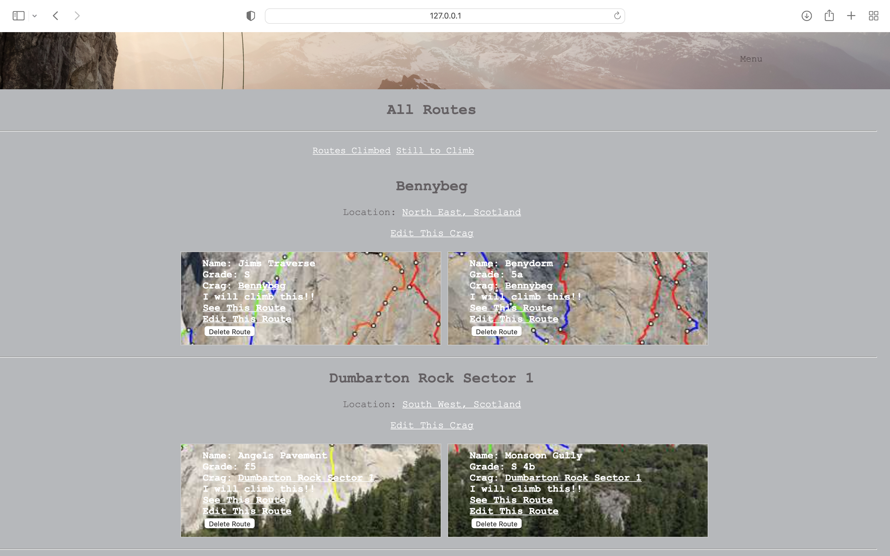
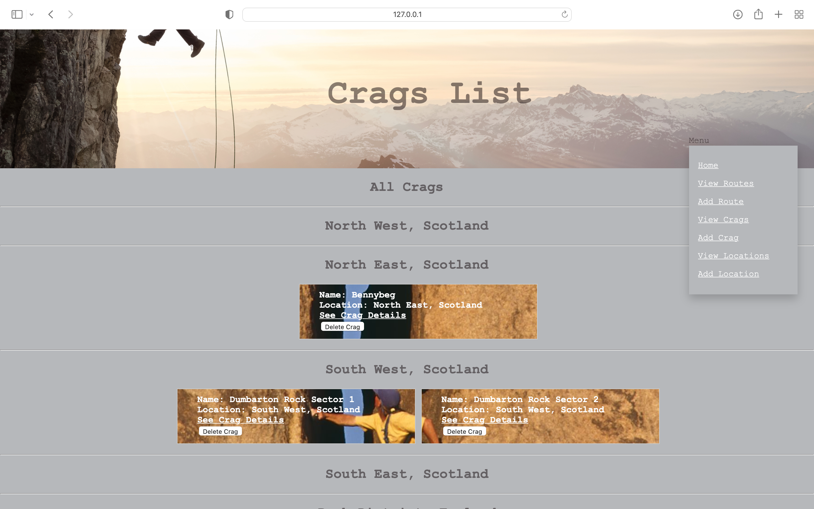
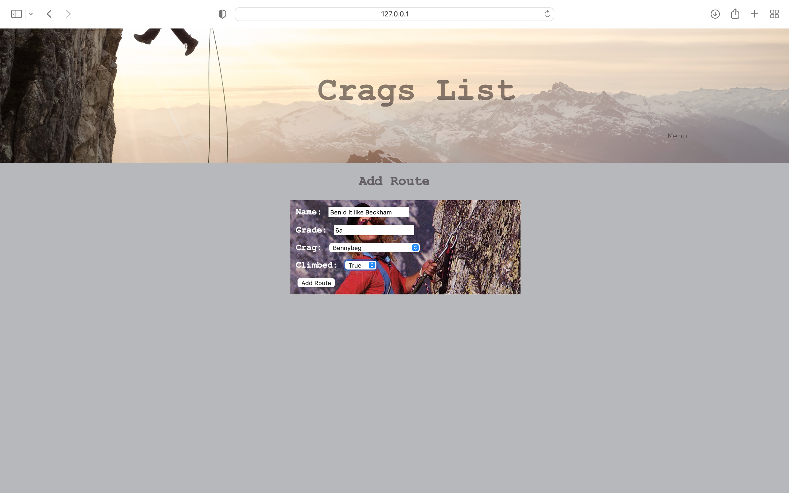
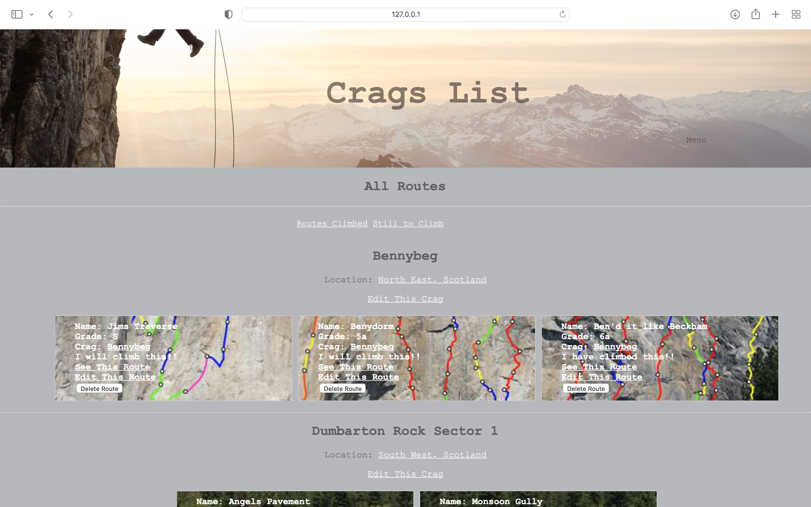

# Welcome to Crags List!!
Your one stop shop for logging routes you have climbed or wish to climb!!

This was my first CodeClan project. It's built using Python and PostgreSQL and is your classic CRUD web app. 

# Screenshots

## Homepage!

## See all your routes organised by Crag!!

## See just the routes you haven't yet climbed!!

## Organise Crags by Location!!

## Add routes to your Climb List!!

